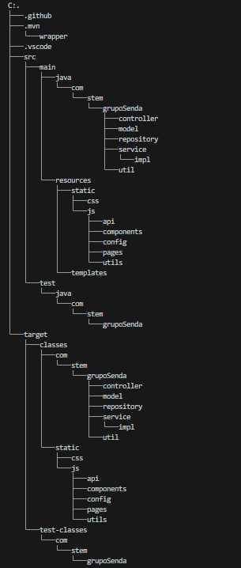
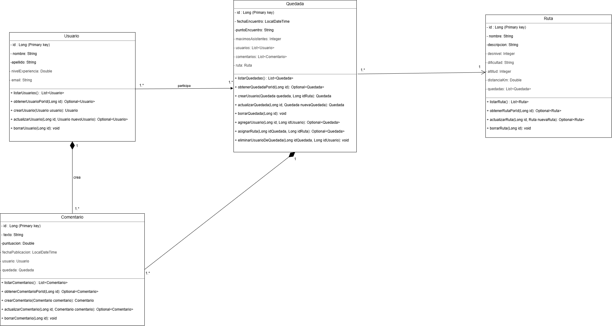

# 🏔️ Grupo Senda

Proyecto **Grupo Senda**.

Este es un proyecto web que he desarrollado utilizando **Java y SpringBoot**. La idea principal de la aplicación es crear una pagina web donde la gente pueda organizar rutas de senderismo y gestionar quedadas en la montaña, ya que es mi hobbie preferido.

A través de la web, los usuarios pueden explorar rutas, organizar quedadas, apuntarse a eventos y, una vez terminada la actividad, dejar sus comentarios y valoraciones. He organizado el código en distintas capas (Controladores, Servicios y Repositorios) para que sea escalable y fácil de mantener.

---

## 🎥 Presentación en Vídeo

En el siguiente vídeo explico en detalle la arquitectura del proyecto, el código y hago una demostración tantoi en Postman con h2 como en la pagina web:

https://youtu.be/e-uCATvO28s

**Índice de contenidos:**

* [00:00 - Introducción]
* [00:41 - Explicación Diagrama]
* [03:00 - Explicación Estructura]
* [04:19 - Explicación Backend]
* [07:42 - Explicación Frontend]
* [12:02 - Funcionamiento de la página con Postman]
* [14:18 - Demostración de la página web sincronizada con la base de datos H2]

---

## 🛠️ Tecnologías que he utilizado

**Backend:**

* Java 25
* Spring Boot 4.0.6
* Spring Data JPA
* Maven
* Base de datos H2
* JavaFaker (para generar datos de prueba)

**Frontend:**

* HTML5
* JavaScript
* Bootstrap 5.3 para el diseño

---

## 📐 Arquitectura y Funcionamiento

He estructurado el proyecto por capas, aqui un ejemplo de como quedan los archivos:

El flujo de información de la pagina web es:
`Frontend -> Controller -> Service -> Repository -> Base de datos H2`

## 📦 Modelo de Datos

La información en cuatro clases principales:

* **Usuario:** Guarda el perfil de la persona que participa (id, nombre, apellido, email y nivelExperiencia).
* **Ruta:** Es la ficha con los datos del recorrido (id, nombre, descripcion, desnivel, altitud, dificultad y distanciaKm).
* **Quedada:** Representa la zona, fecha y gente que van a realizar una ruta (id, fechaEncuentro, puntoEncuentro y maximosAsistentes).
* **Comentario:** Las opiniones que dejan los usuarios tras una actividad (id, texto, puntuacion y fechaPublicacion).

### ¿Qué se puede hacer en la app?

Para darle realismo al proyecto, no me he limitado a hacer un CRUD básico, sino que he añadido varios controles de errores en las clases service:

* **Usuarios:** Tienen un nivel de experiencia. El sistema comprueba que no haya emails duplicados al registrarse.
* **Quedadas:** Tienen control de aforo (no puedes apuntarte si está llena) y control de fechas (un usuario no puede estar en dos quedadas el mismo día).
* **Comentarios:** Solo puedes dejar una valoración por quedada para evitar el spam.

Aqui dejo un diagrama UML de mi proyecto:

--------

## 🚀 Cómo ejecutar el proyecto

Si quieres clonar y probar este proyecto en tu equipo, sigue estos pasos:

### 1. Requisitos del sistema

Asegúrate de tener instalado lo siguiente en tu ordenador:

* **Java 25** (o una versión superior compatible).
* Un navegador web moderno.

### 2. Ejecucion de la aplicacion

Para poder ejecutar la aplicacion debes hacer los siguientes pasos:

* Inicia el programa: Para inicial el programa lo unico que debes hacer es ir al archivo **GrupoSendaApplication.java** y darle a la opcion que pone run.
* Una vez iniciado: Esperamos a que la aplicacion inicie y genere los datos falsos. Posteriormente iremos a nuestra pagina web y en el buscador pondremos lo siguiente: **http://localhost:8081/**, el cual es el puerto que esta configurado en el archivo de application.properties.
* Una vez iniciado podremos visualizar los datos guardados tanto en la propia pagina web como utilizando **h2-console**.

### 3. Ejecucion H2-console

Para comprobar las tablas directamente en la base de datos relacional en memoria:

1. Abre tu navegador e ingresa a: `http://localhost:8081/h2-console`
2. Configura los campos de la ventana de login con los siguientes parámetros exactos:
   * **JDBC URL:** `jdbc:h2:mem:rutas`
   * **User Name:** `sa`
   * **Password:** (Déjalo completamente vacío, sin escribir nada)
3. Haz clic en el botón **Connect**.

### 4. Rutas relevantes de la API

Si prefieres consumir los datos directamente en formato JSON mediante herramientas como Postman, estas son las rutas que puedes utilizar, (todas empiezan con `/api/v1`).

#### Usuarios:

* `GET /api/v1/usuarios` - Listar todos los usuarios.
* `GET /api/v1/usuarios/{id}` - Obtener detalles de un perfil.
* `POST /api/v1/usuarios` - Registrar un nuevo usuario.
* `PUT /api/v1/usuarios/{id}` - Actualizar datos del usuario.
* `DELETE /api/v1/usuarios/{id}` - Eliminar usuario.

#### Rutas de senderismo:

* `GET /api/v1/rutas` - Ver listado de senderos técnicos.
* `GET /api/v1/rutas/{id}` - Ver información específica de una ruta.
* `POST /api/v1/rutas` - Crear una nueva ruta.
* `PUT /api/v1/rutas/{id}` - Editar detalles de la ruta.
* `DELETE /api/v1/rutas/{id}` - Borrar ruta.

#### Quedadas y Aforo:

* `GET /api/v1/quedadas` - Ver eventos planificados.
* `POST /api/v1/quedadas/ruta/{idRuta}` - Crear una quedada y asociarla a una ruta.
* `POST /api/v1/quedadas/{idQuedada}/usuarios/{idUsuario}` - Inscribir usuario al evento.
* `DELETE /api/v1/quedadas/{idQuedada}/usuarios/{idUsuario}` - Desapuntar a un usuario.

#### Comentarios:

* `GET /api/v1/comentarios` - Ver todos los comentarios.
* `POST /api/v1/comentarios` - Enviar nueva valoración (puntuación del 0 al 5).
* `DELETE /api/v1/comentarios/{id}` - Borrar un comentario

### 5.Ejecucion del swagger

Otra forma de ver las rutas de la api es haciendo:

* Inicia el repositorio GrupoSendaApplication.java
* Abre un navegador web y en el buscador añade: **http://localhost:8081/swagger-ui.html**

---

## 💡 Futuras mejoras

Tengo pensado seguir ampliando el proyecto en el futuro añadiendo:

* Autenticación y roles.
* Subida real de imágenes para los perfiles y las rutas.
* Añadir una imagen por google maps interactiva de como seria la ruta y puntos clave de la misma, para cuando la gente suba fotos poder poner la foto en el propio link de google maps y que aparezca en mitad de la ruta.
* Añadir tambien un apartado para que aparezcan refugios disponibles por si sucede algun incombeniente.
* Añadir un apartado para que en la quedada se muestren los materiales necesarios para hacer una ruta.
